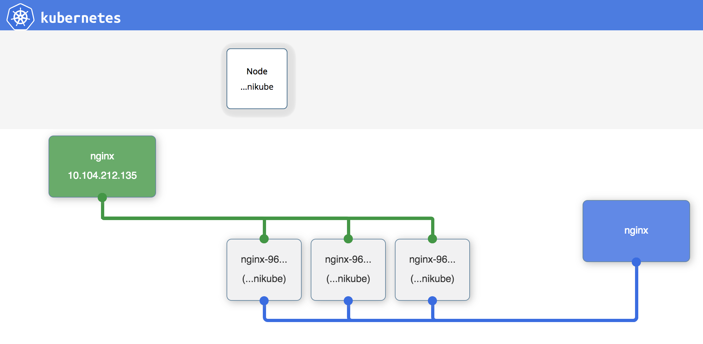

## Kubernetes/Container Engine Visualizer

This is a simple visualizer for use with the Kubernetes API.

### Usage:
   * First install a Kubernetes or Container Engine Cluster
   * ```git clone https://github.com/timfanda35/gcp-live-k8s-visualizer.git```
   * ```cd gcp-live-k8s-visualizer.git```
   * ```kubectl proxy --www=.```
   * Browse : `http://127.0.0.1:8001/static/`

That's it.  The visualizer uses labels to organize the visualization.  In particular it expects that
   * Add `visualize=true` label to resources for presesnt.
   * pods, replicationcontrollers, services, deployment have a ```name``` label, and pods and their associated replication controller share the same ```name```, and
   * the pods in your cluster will have a ```uses``` label which contains a comma separated list of services that the pod uses.

### Colors
* Node:
  * healthy: White
  * non-healthy: Red
* Service: Grean
* Pod:
  * running: Gray
  * pending: Yellow
  * not-ready: Red
  * terminating: Red
* ReplicaController: Blue
* Deployment: Blue

### Example

```shell
kubectl run nginx --image=nginx \
  --labels=visualize=true,name=nginx \
  --replicas=3

kubectl expose deploy nginx \
  --labels=visualize=true,name=nginx \
  --selector=name=nginx \
  --port=80
```



see more: https://kubecloud.io/setting-up-kubernetes-visualization-of-a-cluster-96826433fc64
